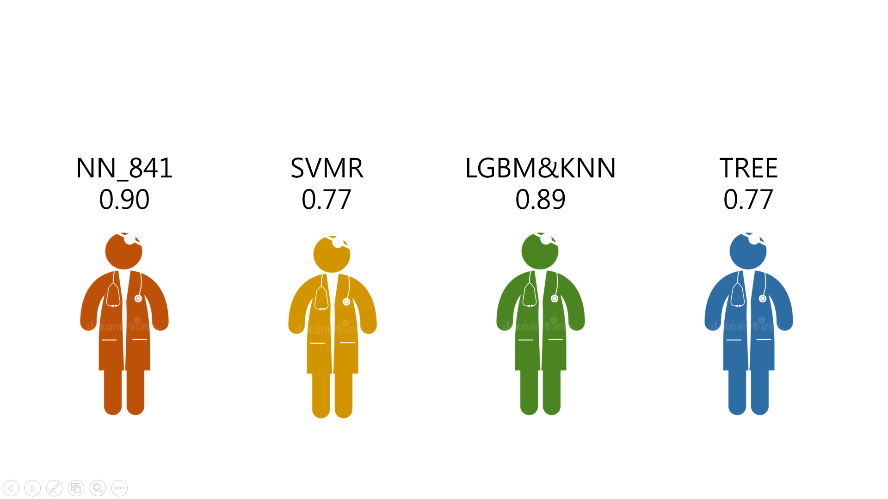

# NDHU_DM_Pima_Indian_Diabetes

*A data mining project*

## Model accuracy

| **Model type** | **Accuracy** | **Comment** |
|:-------:|:------:|:-------------------:|
| **Tree** | **0.6948** | Decision tree |
| **Tree_Lite** | **0.7857** |
| **NN** | **0.6948** | Neural network |
| **NN_Lite** | **0.7792** |
| **NN_841** | **0.9090** | 8x4x1 Neural network and greedy method |
| **SVML** | **0.7467** | Support Vector Machines |
| **SVML_Lite** | **0.7532** |
| **SVMR** | **0.7662** | SVM Regression |
| **SVMR_Lite** | **0.7532** |
| **LGBM** | **0.8896** | LightGBM |
| **KNN** | **0.8181** |  K-Nearest Neighbors |
| **LGBMKNN** | **0.8896** |

*The model with the suffix _lite uses a condensed data set.*

*(Use Apriori algorithm for preprocessing)*

.

## Who is the best doctor?

## Data set
*using "Pima Indians Diabetes Database"*

https://www.kaggle.com/uciml/pima-indians-diabetes-database
